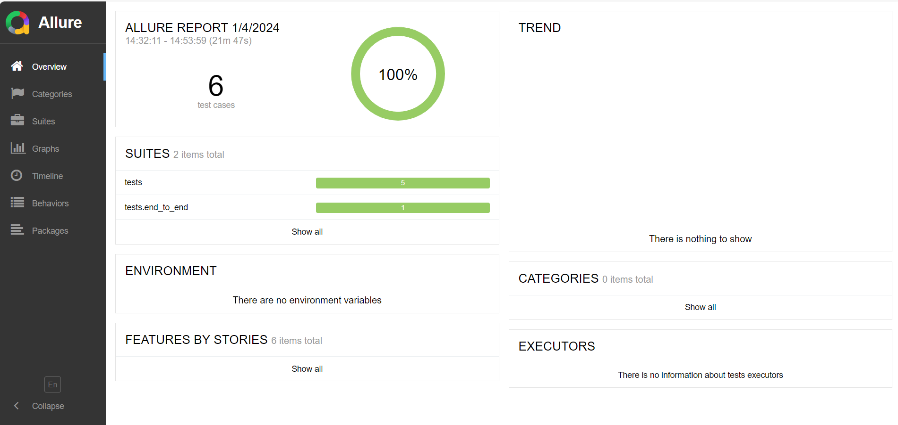
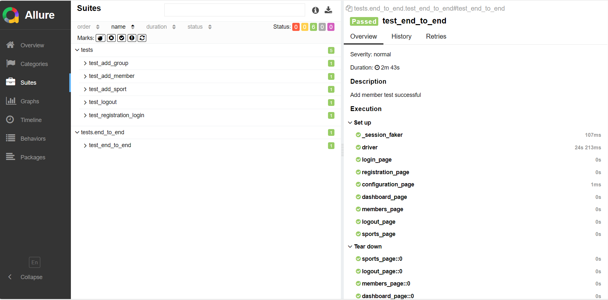

## About Clubix :
Clubix is a mobile application specially crafted for the efficient administration and organization of the gym/fitness center. 

## About Appium :
Appium is an open-source automation tool used for automating mobile applications across various platforms like Android, iOS, and Windows.

### Test Cases : 
1. Registration, followed by login and configuration
2. adding sports
3. adding groups
4. adding members
5. Logout

### Allure Report : 

  

### Automation Output Video : 

  

### Technology used :
- Appium
- Python
- Pytest

### Tests execution :
1- Create a virtual environment

    python -m venv venv
2- Activate the environment
    
    .\venv\Scripts\Activate.ps1
3- Install the libraries

    pip install -r requirements.txt
4- Run the tests

    pytest <test_name>
5- Run allure-pytest

    pytest --alluredir=allure-results <test_name>
6- Launch the Allure server to view the results

    allure serve allure-results